[github](https://github.com/pixelpeg) &nbsp;·&nbsp;
[email](mailto:invinciblecodes@gmail.com)
<!-- add when you have the URLs:
[site](https://example.com) &nbsp;·&nbsp; [linkedin](https://www.linkedin.com/in/...) -->

> Backend engineer at A.P. Moller Maersk, in Bengaluru. 
> Logistics systems by day; small, opinionated tools the rest of the time.

I work on Athena, Maersk's supply chain integration platform — Kotlin, Spring 
Boot, Kafka and Postgres on Kubernetes. Before that, the RFQ quote automation 
product, where a GenAI document pipeline took per-file processing from four 
hours to ninety seconds and the work took four Danish Digital Awards.

Off the clock I build the things I keep wishing existed: a push hook that will 
not let me leak a key, a trading bot whose risk rules I cannot argue with.

<samp>kotlin &nbsp; java &nbsp; typescript &nbsp; python &nbsp; spring boot &nbsp; kafka &nbsp; postgres &nbsp; react &nbsp; docker &nbsp; kubernetes &nbsp; git</samp>

**[guard-push](https://github.com/pixelpeg/guard-push)** &nbsp;·&nbsp; <samp>python, shell</samp> 
Stops you git-pushing API keys. A hook checks every push before it leaves the 
machine: known key formats are blocked outright, anything ambiguous goes to an 
AI call that never sees the secret itself.

**mlue-bot** &nbsp;·&nbsp; <samp>python, streamlit</samp> &nbsp;·&nbsp; <samp>private</samp> 
Intraday bot for NSE ETFs and weekly options, with a live dashboard on the same 
brain. Two walled-off capital sleeves, a 1% hard stop set at entry and never 
widened, and an -8% circuit breaker that halts trading until a human resumes it.

**portfolio** &nbsp;·&nbsp; <samp>react, typescript, vite</samp> &nbsp;·&nbsp; <samp>private</samp> 
One scroll on a single off-white surface. Tailwind v4 and Motion, one typeface, 
and a pink pixel cursor.

**[neetcode-150](https://github.com/pixelpeg/my-neetcode-150-java-submissions)** &nbsp;·&nbsp; <samp>java</samp> 
The 150, worked through in Java. Committed as solved, not as polished.

Every graphic here is generated, not embedded from anyone else's server. 
`ascii.svg` is [`scripts/avatar.svg`](scripts/avatar.svg) pushed through a 
character ramp by [`scripts/make_portrait.py`](scripts/make_portrait.py); the 
stat graphics and these section headings are drawn by 
[a scheduled action](.github/workflows/stats.yml) straight from the GitHub 
GraphQL API, once a day, committing only what changed.

They animate with SMIL inside the SVG, because GitHub strips scripts from 
READMEs — and since nothing loads from a third party, nothing here can 
rate-limit or go dark. The headings are SVGs for the same reason: GitHub also 
strips CSS, so an image is the only way to put this page's own typeface on them.

The portrait source is flat vector art rather than a photograph, so it takes 
`make_portrait.py --flat`: no background-removal model and no local contrast 
pass, because an illustration has no lighting to recover and evening out a flat 
fill only turns it into texture. What has to go is backdrop in two forms — the 
card colour behind the subject, matched by colour distance, and the darker page 
behind the card's rounded corners, which is exactly the value of the hair and so 
is flood-filled from the corner pixels instead.

The typeface is [JetBrains Mono](scripts/fonts), subset to just the characters 
each graphic draws and inlined as base64. That isn't only for looks: the 
portrait's grid assumes an advance width of exactly 0.600 em, and a viewer whose 
default monospace is narrower would otherwise see it squeezed.

Language totals cover public repositories only. `year.svg` uses the portrait's 
character ramp: `:` `+` `#` `@`, quiet to loud.
